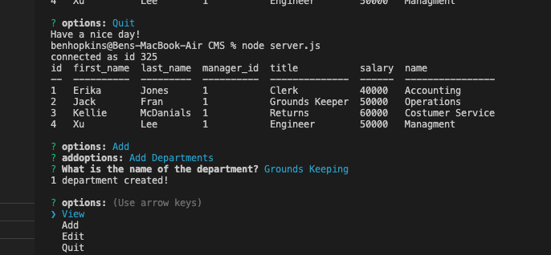

  # Content Management

  

  ## Description

  A command line application used for keeping track of companie resources. More specificaly, employees, what they are paid, their title, and what department they work in. 

  ## Images

  

  
  ## Table of Content

  * [Installation](#installation)

  * [Usage](#usage)

  * [License](#license)

  * [Contributing](#contributors)

  * [Contact](#questions/contact)

  ## Installation

  To Install necessary dependencies, run the following command:
  
  init i

  ## Usage

      Once program is running, you are provided with 4 otions, View, Add, Edit, and Quit. Right now, the Edit option can only edit the employee's role. Other than that you may view a list of departments, a list of employees, or an over-all view. You may also add employees, departments, and roles as needed. To end the program, select quit on the main page.
  
  ## Technologies

      mySql, inquirer, and javascript.

  ## Contributors

  Ben Hopkins

  ## Questions/Contact

  <a href="https://github.com/bh007183">GitHub Profile</a>
  <a href="mailto:bjhops17@gmail.com"> Email Me</a>
  
  

  